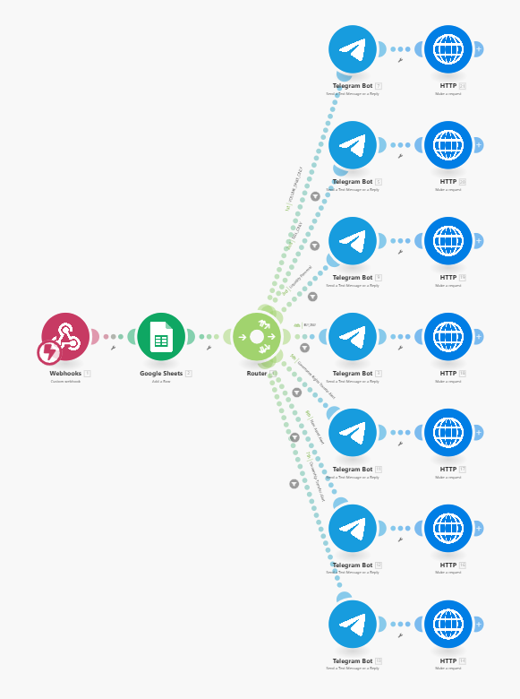

QX AlphaRadar
Real-Time On-Chain Intelligence for Qubic Traders

QX AlphaRadar is a real-time event detection and alerting system built for the Qubic Hackathon.
It monitors the Qubic chain for high-impact events and instantly sends actionable alerts to Telegram, Discord, and Google Sheets for analytics.

This project demonstrates how raw blockchain data can be transformed into meaningful trading intelligence using automation, routing logic, and a lightweight dashboard.

📽️ Demo Video

➡️ Demo Video: https://your-demo-link.com

📸 Screenshots

Workflow Automation (Make.com)

Telegram Alerts

Discord Alerts

Google Sheets Log

Dashboard UI

🔥 Key Features
⚡ Real-Time Event Detection

Buy Orders (AddToBidOrder)

Sell Orders (AddToAskOrder)

Whale Transactions

Liquidity Drains

Governance Transfers

Ownership Transfers

Volume Spikes

📡 Multi-Channel Alerts

Telegram Bot Notifications

Discord Webhooks

Google Sheets Logging

📊 Analytics & Insights

Volume trends

Whale behavior

Governance activity

Liquidity heatmaps

🧠 Smart Routing Logic

Each event type is automatically classified and formatted using custom Make.com blueprints.

🧩 System Architecture
       Qubic Blockchain Events
                 │
                 ▼
         EasyConnect Alerts
                 │ (Webhook)
                 ▼
        ┌────────────────────────┐
        │     Make.com Router    │
        └────────────────────────┘
       /        |         |        \
      ▼         ▼         ▼         ▼
Telegram   Discord   Google Sheets  Dashboard UI
 Alerts     Alerts     Data Log     (index.html)

🛠 Tech Stack
Layer	Technology
Event Source	EasyConnect (Qubic)
Automation Engine	Make.com
Alerts	Telegram Bot, Discord Webhooks
Storage	Google Sheets
Dashboard	HTML, CSS, JavaScript
📂 Project Structure
/
├── index.html      # Dashboard UI
├── style.css       # Styling
├── index.js        # Frontend logic
└── assets/         # Screenshots & images

Create the assets/ folder and place all images inside it.

🔧 How It Works

1️⃣ EasyConnect listens to Qubic blockchain events
2️⃣ Sends structured JSON to a Make.com webhook
3️⃣ Router determines event type
4️⃣ Custom formatters generate human-readable messages
5️⃣ Alerts are sent instantly to Telegram + Discord
6️⃣ Event logs are written to Google Sheets
7️⃣ Dashboard UI displays recent activity

🚀 Future Enhancements

AI-based wallet scoring

Multi-token monitoring

Sentiment-driven alerting

Historical trend prediction

Mobile app alerts

Full real-time dashboard with charts

🙏 Acknowledgements

Qubic Team

EasyConnect Developers

Make.com Automation Platform

lablab.ai Mentors

👤 Developer

Naveen (Nexorax-nk)
Backend Automation • Architecture • Dashboard

