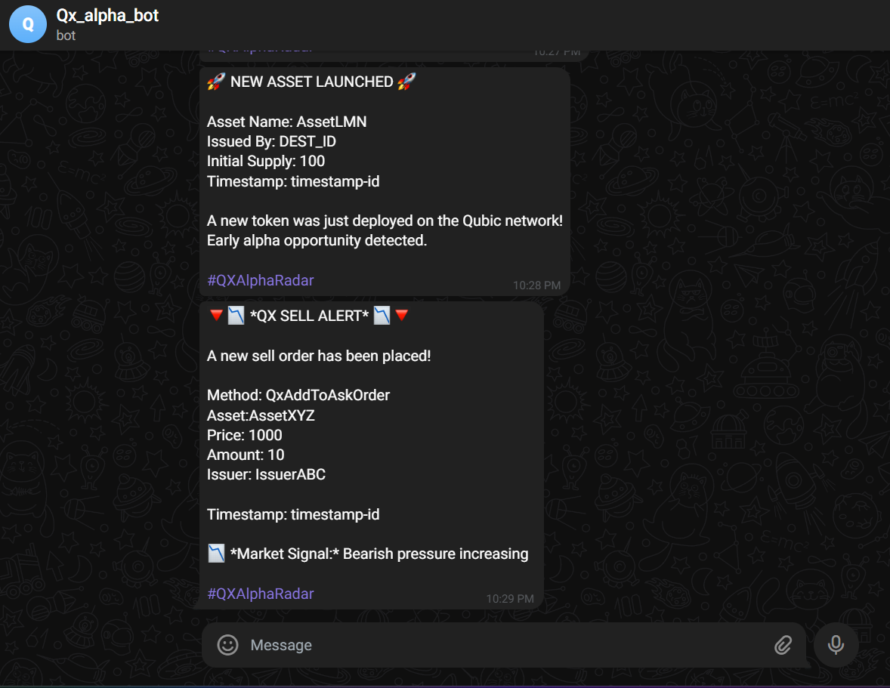
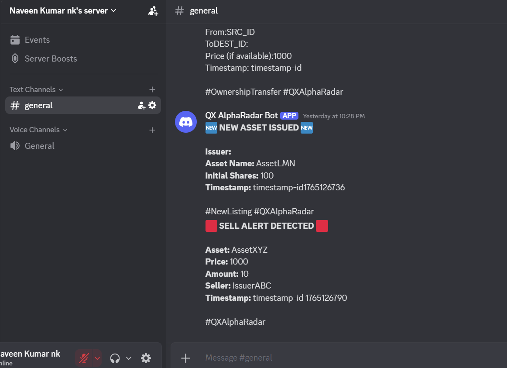
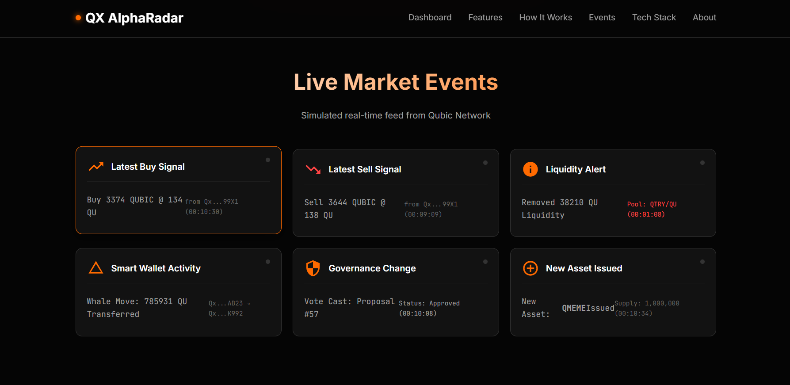

<h1 align="center">QX AlphaRadar</h1>
<h3 align="center">Real-Time On-Chain Intelligence for Qubic Traders</h3>

  <b>Instant alerts • Whale tracking • Liquidity monitoring • Governance intelligence</b>

---

##  Overview

**QX AlphaRadar** is a real-time event detection and alerting system built for the **Qubic Hackathon**.  
It monitors the Qubic chain for high-impact events and instantly delivers actionable alerts to **Telegram**, **Discord**, and **Google Sheets**.

This project shows how raw blockchain noise can be converted into meaningful trading intelligence using powerful automation flows and a lightweight analytics dashboard.

---

##  Demo Video

👉 **Watch the full demo:**  
https://your-demo-link.com

---

##  Screenshots

### **📡 Workflow Automation (Make.com)**

  

---

### **📲 Telegram Alerts**

  

---

### **💬 Discord Alerts**

  

---

### ** Google Sheets Logging**

  

---

### **🖥️ Dashboard UI**

  

---

##  Key Features

### ⚡ Real-Time Event Detection  
- Buy Orders (`AddToBidOrder`)  
- Sell Orders (`AddToAskOrder`)  
- Whale Transactions  
- Liquidity Drains  
- Governance Transfers  
- Ownership Transfers  
- Volume Spikes  

### 📡 Multi-Channel Alert Delivery  
- Telegram Bot  
- Discord Webhooks  
- Google Sheets Log  

### 📊 Insights & Analytics  
- Volume trends  
- Whale activity  
- Liquidity heatmaps  
- Governance monitoring  

---

## 🧠 System Architecture

  

---
